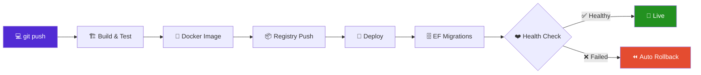

<!-- ===================== HEADER (animated wave) ===================== -->
<div align="center">
  
</div>

<!-- ===================== TYPING ANIMATION ===================== -->
<div align="center">
  <a href="https://github.com/subhedaher">
    
  </a>
</div>

<div align="center">
  
  
  
  
  
  
</div>

<p align="center">
  
</p>

---

## 👨‍💻 About Me

```csharp
public sealed class SubheDaher : IBackendEngineer, IDevOpsEngineer
{
    public string Role       => ".NET Backend Engineer | DevOps";
    public string Location   => "Cairo, Egypt 🇪🇬";
    public int    Experience => 4; // years, production systems

    public string[] Stack => new[]
    {
        "ASP.NET Core", "EF Core", "SignalR", "Hangfire", "MediatR",
        "Docker", "GitHub Actions", "Nginx", "Linux", "AWS"
    };

    public string Philosophy =>
        "Ship fast, ship safe: modular code + automated pipelines.";

    public Task<Release> TakeFeatureToProduction(Feature f) =>
        f.Design()        // Clean Architecture + CQRS
         .Build()         // .NET 
         .Containerize()  // Docker
         .Deploy()        // GitHub Actions → push-to-deploy
         .Monitor();      // Serilog + Health Checks
}
```

- 🏢 **.NET Backend Engineer @ AI Cloud**: powering a real-time smart ERP fed by **100+ IoT devices**
- 🏗️ I design modular backends with **Clean Architecture & CQRS**, then automate the whole delivery pipeline
- 🔁 Every release: **build → push → deploy → migrate → health check → rollback**
- 🛡️ Secure production on **Linux + Nginx + SSL/TLS (auto-renewing)**
- 📫 **subhedaher@gmail.com**

---

## 📊 Impact in Numbers

<div align="center">

| ⚡ 100+ | 🧩 18 | 🔌 120+ | 🔐 64 | 🚢 10+ |
|:---:|:---:|:---:|:---:|:---:|
| **IoT devices** streaming into a live ERP | **Modules** in one compliance platform | **REST endpoints** delivered | **Permissions** mapped to policies & JWT claims | **Production backends** delivered |

</div>

---

## 🔄 How I Ship (CI/CD Pipeline)



---

## 🛠️ Tech Stack

### 🟣 .NET & Backend
<p>


</p>

### 🏛️ Architecture & Security
<p>


</p>

### 🐳 DevOps & Cloud
<p>


</p>

### 📈 Reliability & Observability
<p>


</p>

### 🗄️ Data & Tools
<p>


</p>

<sub>Also worked with: PHP · Laravel · JavaScript</sub>

---

## 🚀 Featured Projects

<table>
<tr>
<td width="50%" valign="top">

### 🛃 AlSalam Import Compliance Platform
`ASP.NET Core` `CQRS` `Hangfire` `Docker` `GitHub Actions`

- **18 modules / 120+ endpoints**: companies, suppliers, products, shipments, documents
- ⏰ Automated **expiry-reminder engine** (Hangfire + HTML email templates)
- 🔐 **RBAC**: 64 permissions → policies + JWT claims, audit trail, soft-delete/restore
- 🌍 Bilingual **EN / AR**
- 🐳 **Stage + Production** envs with push-to-deploy & automated migrations

</td>
<td width="50%" valign="top">

### 🧠 Smart ERP (Real-time IoT)
`ASP.NET Core` `SignalR` `Clean Architecture` `Nginx`

- ⚡ Live dashboards & instant notifications from **100+ IoT devices**
- 🧩 Independent modules: tasks, attendance, resource allocation
- 🚢 Full release automation: build → deploy → migrate → health check → **rollback**
- 📈 Serilog + health checks + monitoring for faster troubleshooting

</td>
</tr>
<tr>
<td width="50%" valign="top">

### 🛒 E-Commerce Platform
`ASP.NET Core` `Clean Architecture` `EF Core`

- Catalog with variants, inventory, cart, discounts & coupons
- Secure checkout with **transactional integrity** across the full order lifecycle

</td>
<td width="50%" valign="top">

### 🏘️ PropTech Platform (Bikam) 🇸🇦
`Laravel` `MySQL` · *Project Manager & Backend*

- Real estate valuation platform for the Saudi market
- Scalable schema design + automated valuation workflow

</td>
</tr>
</table>

---

## 🎓 Education & Certifications

- 🎓 B.Sc. Software Development: *Islamic University of Gaza*
- ☁️ **AWS DevOps & Cloud Fundamentals**: Cloud Native Base Camp (2025)
- 🏛️ **Software Architecture**: Udemy (2024)
- 🌐 **ASP.NET Core Web Development**: Udemy (2023)

---

## 📈 GitHub Stats

<div align="center">
  
  
</div>

<div align="center">
  
</div>

<div align="center">
  
</div>

---

## 🐍 Contribution Snake

<div align="center">
  
</div>

---

## 🤝 Let's Connect

<p align="center">
  <a href="https://www.linkedin.com/in/subhe-daher-843764214" target="_blank">
    
  </a>
  <a href="mailto:subhedaher@gmail.com">
    
  </a>
  <a href="https://www.facebook.com/profile.php?id=100007729127811" target="_blank">
    
  </a>
  <a href="https://www.instagram.com/subhedaher/" target="_blank">
    
  </a>
</p>

<div align="center">

### 💼 Open for .NET & DevOps opportunities

**"First, solve the problem. Then, write the code."** – John Johnson

</div>


